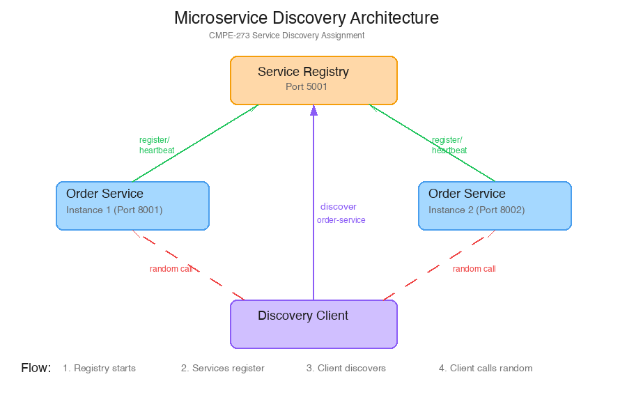

# CMPE-273 Week 7: Naming and Service Discovery Assignment

**Name:** Vineet Kumar
**ID:** 019140433

A microservice system that uses a central service registry for service discovery. Two instances of an order service register themselves with the registry, and a client discovers them at runtime and routes requests to a random instance.

## Architecture



1. The registry starts first and listens on port 5001
2. Two order service instances start on ports 8001 and 8002, each registers itself with the registry and starts sending heartbeats every 10 seconds
3. The client calls `GET /discover/order-service` to get all active instances, picks one at random, and sends the request
4. If an instance stops sending heartbeats for 30 seconds, the registry removes it

## Prerequisites

- Python 3.8+
- pip

## Setup

```bash
python3 -m venv venv
source venv/bin/activate
pip install -r requirements.txt
```

## Running the Demo

The easiest way to see everything in action:

```bash
chmod +x week-7-demo.sh
./week-7-demo.sh
```

This starts the registry, both service instances, runs the discovery client, and demonstrates graceful shutdown.

## Running Manually

Open four separate terminals (make sure venv is activated in each):

**Terminal 1 - Registry:**
```bash
python3 service_registry.py
```

**Terminal 2 - Order Service Instance 1:**
```bash
python3 order_service.py --port 8001
```

**Terminal 3 - Order Service Instance 2:**
```bash
python3 order_service.py --port 8002
```

**Terminal 4 - Client:**
```bash
python3 client.py --rounds 10
```

## Proof of Functionality

### 1. Registry Health Check

```
$ curl -s http://localhost:5001/health | python3 -m json.tool
{
    "status": "healthy",
    "timestamp": "2026-03-18T19:58:08.323686"
}
```

### 2. Both Instances Register Successfully

After starting both order service instances, the registry shows 2 active instances:

```
$ curl -s http://localhost:5001/services | python3 -m json.tool
{
    "services": {
        "order-service": {
            "active_instances": 2,
            "total_instances": 2
        }
    },
    "total_services": 1
}
```

Service startup logs:
```
[REGISTERED] order-service at http://localhost:8001
[STARTED] order-service-8001 on http://localhost:8001

[REGISTERED] order-service at http://localhost:8002
[STARTED] order-service-8002 on http://localhost:8002
```

### 3. Discovery Returns Both Instances

```
$ curl -s http://localhost:5001/discover/order-service | python3 -m json.tool
{
    "count": 2,
    "instances": [
        {
            "address": "http://localhost:8001",
            "uptime_seconds": 4.954628
        },
        {
            "address": "http://localhost:8002",
            "uptime_seconds": 2.963674
        }
    ],
    "service": "order-service"
}
```

### 4. Client Randomly Distributes Requests Across Instances

Running the client for 10 rounds shows requests going to both instances:

```
$ python3 client.py --rounds 10
============================================================
SERVICE DISCOVERY CLIENT
============================================================
Registry: http://localhost:5001
Action:   list
Rounds:   10
============================================================

=== Round 1/10 ===
Discovered 2 instance(s): ['http://localhost:8001', 'http://localhost:8002']
Selected: http://localhost:8001
Response from instance: order-service-8001
Orders returned: 3
---

=== Round 2/10 ===
Discovered 2 instance(s): ['http://localhost:8001', 'http://localhost:8002']
Selected: http://localhost:8002
Response from instance: order-service-8002
Orders returned: 3
---

=== Round 3/10 ===
Discovered 2 instance(s): ['http://localhost:8001', 'http://localhost:8002']
Selected: http://localhost:8002
Response from instance: order-service-8002
Orders returned: 3
---

=== Round 4/10 ===
Discovered 2 instance(s): ['http://localhost:8001', 'http://localhost:8002']
Selected: http://localhost:8001
Response from instance: order-service-8001
Orders returned: 3
---

=== Round 5/10 ===
Discovered 2 instance(s): ['http://localhost:8001', 'http://localhost:8002']
Selected: http://localhost:8002
Response from instance: order-service-8002
Orders returned: 3
---

=== Round 6/10 ===
Discovered 2 instance(s): ['http://localhost:8001', 'http://localhost:8002']
Selected: http://localhost:8002
Response from instance: order-service-8002
Orders returned: 3
---

=== Round 7/10 ===
Discovered 2 instance(s): ['http://localhost:8001', 'http://localhost:8002']
Selected: http://localhost:8002
Response from instance: order-service-8002
Orders returned: 3
---

=== Round 8/10 ===
Discovered 2 instance(s): ['http://localhost:8001', 'http://localhost:8002']
Selected: http://localhost:8002
Response from instance: order-service-8002
Orders returned: 3
---

=== Round 9/10 ===
Discovered 2 instance(s): ['http://localhost:8001', 'http://localhost:8002']
Selected: http://localhost:8002
Response from instance: order-service-8002
Orders returned: 3
---

=== Round 10/10 ===
Discovered 2 instance(s): ['http://localhost:8001', 'http://localhost:8002']
Selected: http://localhost:8002
Response from instance: order-service-8002
Orders returned: 3
---

============================================================
DISTRIBUTION SUMMARY
============================================================
  order-service-8001: 2/10 requests (20%)
  order-service-8002: 8/10 requests (80%)
```

Both instances received traffic, confirming random load distribution works.

### 5. Graceful Shutdown

When instance 2 is stopped, it deregisters from the registry. The registry immediately reflects the change:

```
[SHUTDOWN] Gracefully stopping order-service-8002...
[DEREGISTERED] order-service at http://localhost:8002
```

After shutdown, only instance 1 remains:

```
$ curl -s http://localhost:5001/discover/order-service | python3 -m json.tool
{
    "count": 1,
    "instances": [
        {
            "address": "http://localhost:8001",
            "uptime_seconds": 7.165257
        }
    ],
    "service": "order-service"
}
```

## Tests

### Unit Tests (Order Service)

```bash
$ pytest tests/test_order_service.py -v

tests/test_order_service.py::test_get_orders PASSED                      [ 16%]
tests/test_order_service.py::test_get_order_by_id PASSED                 [ 33%]
tests/test_order_service.py::test_get_order_not_found PASSED             [ 50%]
tests/test_order_service.py::test_create_order PASSED                    [ 66%]
tests/test_order_service.py::test_create_order_missing_fields PASSED     [ 83%]
tests/test_order_service.py::test_health PASSED                          [100%]

6 passed in 0.15s
```

### Integration Tests (Full System)

These tests spin up the registry and both service instances as subprocesses and verify the entire discovery flow end-to-end:

```bash
$ pytest tests/test_integration.py -v

tests/test_integration.py::test_registry_health PASSED                   [ 16%]
tests/test_integration.py::test_service_registration PASSED              [ 33%]
tests/test_integration.py::test_service_discovery PASSED                 [ 50%]
tests/test_integration.py::test_client_random_routing PASSED             [ 66%]
tests/test_integration.py::test_individual_instance_responds PASSED      [ 83%]
tests/test_integration.py::test_z_graceful_deregistration PASSED         [100%]

6 passed in 4.30s
```

### All Tests

```bash
$ pytest tests/ -v

12 passed
```

## Files

| File | Purpose |
|------|---------|
| `service_registry.py` | Central registry server (based on professor's sample) |
| `order_service.py` | Order microservice with auto-registration |
| `client.py` | Discovery client with random instance selection |
| `week-7-demo.sh` | One-click demo script |
| `tests/` | Unit and integration tests |
| `docs/architecture.png` | Architecture diagram |
